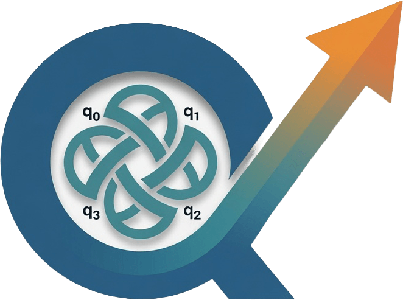
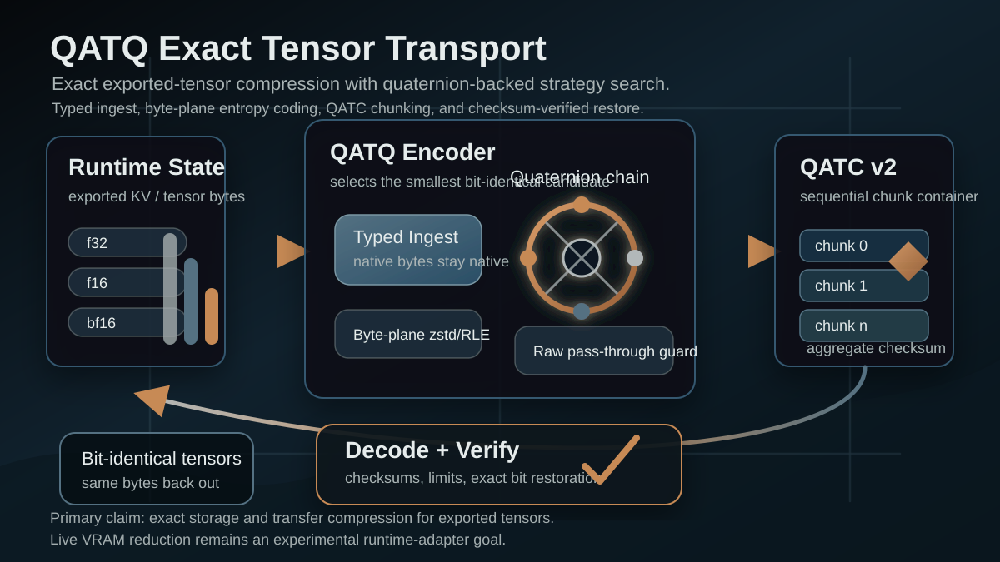

<p align="center">
  
</p>

<p align="center">
  <a href="https://github.com/kabudu/qatq/actions/workflows/ci.yml"></a>
  <a href="https://github.com/kabudu/qatq/actions/workflows/coverage-supply-chain.yml"></a>
  <a href="https://github.com/kabudu/qatq/actions/workflows/release.yml"></a>
  <a href="LICENSE"></a>
  
  
  
</p>

# QATQ

**Exact, portable compression for LLM memory in motion—with a proof-carrying
capacity analysis tool.**

QATQ is a Rust toolkit for exported LLM KV caches and other typed tensor streams.
Its main codec restores input bytes bit-for-bit, while its optional Capacity
Oracle can prove that a requested state count is impossible under a precisely
declared finite binary or spherical model.

QATQ targets storage, transfer, and runtime migration artifacts. It is not a
transparent GPU-memory layer, and it does not claim universal compression wins
or translate observed KV distortion into mathematical separation automatically.

<p align="center">
  
</p>

## Install

Install all production CLIs from the v0.4.1 GitHub release:

```sh
curl --proto '=https' --tlsv1.2 -LsSf \
  https://github.com/kabudu/qatq/releases/download/v0.4.1/qatq-installer.sh | sh
```

On Windows:

```powershell
powershell -ExecutionPolicy Bypass -c "irm https://github.com/kabudu/qatq/releases/download/v0.4.1/qatq-installer.ps1 | iex"
```

Or build the codec from source:

```sh
cargo install --path .
```

To build the Capacity Oracle from source, enable its optional feature:

```sh
cargo build --release --features oracle --bin qatq-oracle
```

## Exact tensor compression

`qatq-exact` is the default codec. It selects the smallest applicable exact
strategy automatically; users do not need to choose internal byte-plane,
delta-XOR, strided-XOR, Zstd, or reversible quaternion-chain transforms.

```sh
# f32 input
qatq encode input.f32le output.qatq
qatq decode output.qatq restored.f32le

# Native half-precision input
qatq encode --dtype bf16 input.bf16le output.qatq
qatq encode --dtype f16 input.f16le output.qatq

# Optional row width for the reversible cross-row predictor
qatq encode --dtype bf16 --stride-elements 128 input.bf16le output.qatq

# Bounded QATC container for large tensors
qatq encode-chunked --max-values-per-chunk 65536 input.f32le output.qatc
qatq decode output.qatc restored.f32le
```

QATQ and QATC writes are atomic. QATC v2 provides bounded sequential chunks and
an aggregate checksum. Comparator codecs remain available for research, but
lossless product claims apply only to `qatq-exact` and QATC.

For runtime capture integration, see
[`docs/LLAMA_CPP_KV_CAPTURE.md`](docs/LLAMA_CPP_KV_CAPTURE.md). For the wire and
strategy design, see [`docs/ARCHITECTURE.md`](docs/ARCHITECTURE.md).

## Capacity Oracle

`qatq-oracle` returns exactly one logical outcome:

- `CONSTRUCTED`: a concrete construction passed every declared constraint;
- `INFEASIBLE_UNDER_MODEL`: a checked finite certificate proves the request
  exceeds an applicable upper bound;
- `UNKNOWN`: supported analysis did not decide the request; or
- `REFUSED`: input was malformed, unsupported, ambiguous, or over budget.

The v0.4.x finite-certified scope is deliberately narrow: exact binary Hamming
bounds and exact spherical Rankin bounds for maximum inner product `s <= 0`.
Positive-inner-product spherical requests and asymptotic rate results cannot produce
finite impossibility claims in this release. Construction search and automatic
KV-to-model derivation are also not shipped.

```sh
qatq-oracle bound examples/oracle/binary-128-d48-48bit.json \
  --output oracle-result

qatq-oracle check oracle-result/certificate.json
```

Completed runs publish a SHA-256-bound evidence bundle atomically. The checker
uses a strict schema and independently recomputes the theorem witness and
decisive inequality. Start with [`docs/oracle/README.md`](docs/oracle/README.md),
then review the [claim boundary](docs/oracle/CLAIM_BOUNDARY.md) and
[trust boundary](docs/oracle/TRUST_BOUNDARY.md).

The v0.4.1 evidence corpus is also independently reproduced by a separate,
pinned SageMath implementation. See the
[machine-readable validation results](validation/oracle-v0.4.1/evidence/results.json)
and the [precise validation terminology](docs/PUBLIC_RELEASE_0_4_1_EVIDENCE.md).

## Rust library

```rust
use qatq::{decode, try_encode, CodecMode};

let values = [0.25_f32, -0.5, 1.0, 2.0];
let payload = try_encode(&values, CodecMode::QatqExact)?;
let decoded = decode(&payload)?;
assert_eq!(values.as_slice(), decoded.as_slice());
# Ok::<(), qatq::QatqError>(())
```

Single payloads are bounded to 67,108,864 values. Use the chunk/container APIs
for larger tensors. Native f16/bf16 callers can use
`try_encode_qatq_exact_tensor_le_with_stride_hint`; opaque 32-bit state can use
the exact u32 container APIs. The public compatibility contract is documented in
[`docs/API_CLI_FREEZE.md`](docs/API_CLI_FREEZE.md).

The additive Oracle API is available under `qatq::oracle` when the `oracle`
feature is enabled.

## Evidence and development

QATQ includes deterministic public fixtures, exactness and corruption tests,
fuzz targets, benchmark gates, comparator reports, and a fresh llama.cpp
integration matrix. The concise entry points are:

- [public compression summary](docs/PUBLIC_COMPRESSION_SUMMARY.md)
- [benchmark and competitive gates](docs/PUBLIC_BENCHMARK_GATE.md)
- [llama.cpp KV matrix](docs/LLAMA_CPP_KV_MATRIX.md)
- [production readiness](docs/PRODUCTION_READINESS.md)
- [v0.4.0 release evidence](docs/PUBLIC_RELEASE_0_4_0_EVIDENCE.md)
- [v0.4.1 independent reproduction evidence](docs/PUBLIC_RELEASE_0_4_1_EVIDENCE.md)
- [release checklist](docs/RELEASE_CHECKLIST.md)
- [roadmap](docs/ROADMAP.md)

Run the primary checks locally:

```sh
cargo fmt --all -- --check
cargo check --all-targets --all-features --locked
cargo test --all-features --locked
cargo test --test kv_stress -- --ignored --nocapture
```

Detailed fixture, benchmark, release, and integration commands live in the
linked documentation rather than on this front page.

## Scope and attribution

QATQ is independent. TurboQuant is credited to the Google Research / Google
DeepMind / NYU work by Amir Zandieh, Majid Daliri, Majid Hadian, and Vahab
Mirrokni. The quaternion/Hamilton-product foundation traces to William Rowan
Hamilton and modern quaternion neural-network research. See
[`docs/CREDITS.md`](docs/CREDITS.md).

Apache-2.0 licensed. QATQ/QATC compatibility, claims, and evidence are versioned
in this repository; historical research comparators are not the default product
path.
